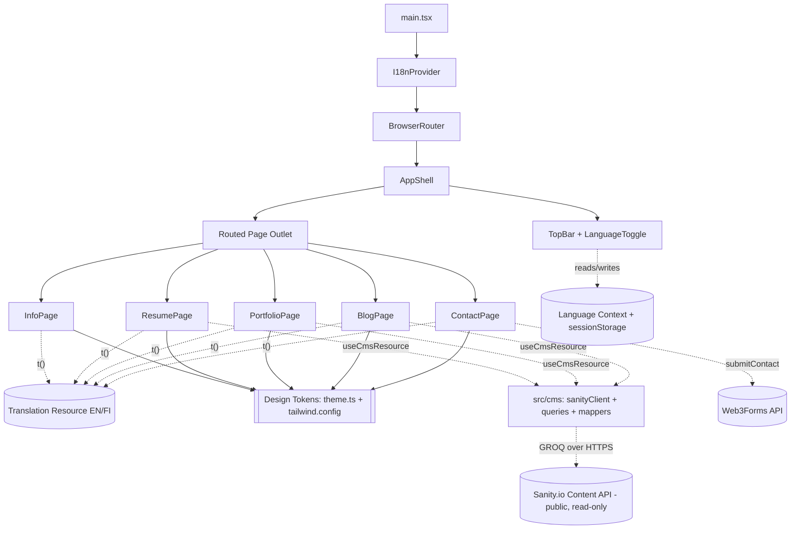

# Design Document

## Overview

**Maija Portfolio** is a static, multi-page personal portfolio and CV website presenting Maija's professional identity across five pages (Info, Resume, Portfolio, On My Mind, Contact me). It follows a strict Nordic-editorial design system, ships English fully with a prepared Finnish toggle, and deploys as pure static files to GitHub Pages or Vercel.

Dynamic content — the resume timeline, portfolio cards, and On My Mind blog entries — is sourced at runtime from the **Sanity.io headless CMS** rather than being hardcoded, so Maija can edit and publish content without touching code or redeploying (Req 12). The site still builds and ships as a static React application; it fetches CMS content over Sanity's public, read-only content API. Contact form submissions are delivered through **Web3Forms**, a third-party service that routes messages directly to Maija's email with no custom backend (Req 13).

This design covers the overall architecture, folder structure, the single-source design-system theme, the internationalization (i18n) layer, the CMS data-access layer and runtime fetching pattern, per-page component breakdown, data models, contact-form validation and Web3Forms delivery, responsive behavior, correctness properties for property-based testing, and the testing strategy. It addresses all 13 requirements.

### Recommended Technical Direction

The requirements were framed around a modular multi-page structure, a centralized design system, client-side language switching, and static deployment. Two stacks were considered:

| Concern | React + Vite + TypeScript (recommended) | Plain HTML/CSS/JS (alternative) |
| --- | --- | --- |
| Modular multi-page structure (Req 1) | Component + page modules, natural fit | Manual file duplication, repeated markup |
| Single-source design tokens (Req 2.6) | Tailwind theme config + TS constants, enforced once | CSS custom properties (workable, but no type safety) |
| Client-side routing, Info default (Req 1.5, 3.5) | react-router with declarative routes | Manual hash/history handling |
| Structured i18n with EN fallback (Req 4.5, 4.6) | Typed translation resource + fallback resolver | Hand-rolled dictionary + manual lookups |
| Tag filtering, tabs, form state (Req 6, 7, 9) | React state, testable pure logic | Manual DOM manipulation, harder to test |
| Static build (Req 1.3) | `vite build` emits static HTML/CSS/JS | Already static |
| Property-based testing (validation, filtering, i18n) | Vitest + fast-check on pure TS functions | Harder to isolate pure logic |

**Decision: React 18 + Vite + TypeScript, styled with Tailwind CSS, routed with react-router-dom.** This stack cleanly satisfies the modular structure, the single-source theme constraint, typed translations with fallback, and static export, while isolating the testable business logic (email validation, tag filtering, blog ordering, translation resolution) into pure functions that property-based tests can exercise directly.

Plain HTML/CSS/JS remains a viable alternative for a site this size and would still meet the requirements, but it pushes routing, i18n resolution, and state management into hand-written imperative code that is harder to keep DRY (Req 2.6) and harder to test. The remainder of this design targets the recommended stack.

### Technology Summary

- **Framework:** React 18 with TypeScript
- **Build tool:** Vite (static build via `vite build`, dev server via `vite`)
- **Routing:** react-router-dom v6 (client-side, `BrowserRouter` with configurable base for subpath hosting; Info is the index route)
- **Styling:** Tailwind CSS with a custom theme extending the default config; design tokens defined once
- **i18n:** A lightweight custom provider backed by a typed, structured translation resource keyed by language code, with EN fallback
- **CMS (Req 12):** Sanity.io headless CMS as the content source for the timeline, portfolio cards, and blog entries. The client uses `@sanity/client` configured for read-only public content access (no write token in the bundle). Content is queried with GROQ and mapped into the existing typed models. Content authoring uses **Sanity Studio**, which can live in a separate `studio/` folder in the repo or be hosted by Sanity; the deployed portfolio bundle does not include the Studio.
- **Contact delivery (Req 13):** Web3Forms (`https://api.web3forms.com/submit`). The public access key is supplied via the `VITE_WEB3FORMS_ACCESS_KEY` environment variable (`import.meta.env`), never hardcoded in component logic.
- **Testing:** Vitest (unit + property tests), fast-check (property-based testing), @testing-library/react (component tests)
- **Deployment:** Static output in `dist/`, deployable to GitHub Pages or Vercel with no server runtime

## Architecture

### High-Level Structure

The application is a single-page React app with client-side routing. A persistent `TopBar` (navigation + language toggle) and the routed page content are wrapped by an `AppShell`. Global state — the active language — is provided by an `I18nProvider` via React context, persisted to `sessionStorage`. All user-facing text flows through a `t()` translation resolver. Design tokens are defined once in the Tailwind theme and a companion TypeScript constants module and consumed everywhere via utility classes and theme references.



### Data Flow

- **Language:** `I18nProvider` holds the active language in React state, initialized from `sessionStorage` (default `EN` if none, per Req 4.1). Selecting a value in `LanguageToggle` calls `setLanguage`, which updates state and writes to `sessionStorage` (Req 4.4). Re-render propagates new text synchronously, well within the 1-second budget (Req 4.3).
- **Dynamic content (Req 12):** The timeline entries, portfolio cards, and blog entries are fetched at runtime from Sanity via the `src/cms/` layer. Each of the Resume, Portfolio, and Blog pages calls a `useCmsResource` hook that issues a GROQ query through `sanityClient`, maps the returned Sanity documents into the existing typed models (`TimelineCategory[]`, `PortfolioCardData[]`, `BlogEntry[]`), and exposes a `{ status, data, error }` state machine. Because the CMS is a published, public, read-only dataset accessed with `useCdn: true` and no write token, content updates appear on the next fetch/page load without a redeploy (Req 12.2, 12.6). The seed values under `src/data/` (see below) are the authored initial CMS content (Req 12.7).
- **Content fetch lifecycle (Req 12.3–12.5):** While a fetch is in flight the section renders a loading indicator (Req 12.3). A fetch that does not resolve within 10 seconds is aborted and treated as failed (Req 12.4). On failure the section shows an error indication, retains any previously loaded content, and — when nothing was previously loaded — falls back to the section's empty-state placeholder: the Blog "no posts" placeholder (Req 8.6) and the Portfolio "no items match"/empty placeholder (Req 7.9), per Req 12.5.
- **Static seed content (Req 12.7):** Typed modules under `src/data/` hold the exact Req 6/7/8 seed values. These are no longer the runtime source; they are the authoring reference used to populate Sanity and to seed tests. Their shapes match the CMS-mapped models exactly so the pure logic and correctness properties are unaffected.
- **Contact delivery (Req 13):** After client-side `validateContact` passes, `ContactPage` calls `submitContact`, which POSTs the submission to Web3Forms with the public access key read from `import.meta.env.VITE_WEB3FORMS_ACCESS_KEY`. Success drives the confirmation (Req 9.8); an error response, network failure, or a >10s timeout drives the error state while retaining entered values (Req 9.9).
- **Translations:** All labels and copy are stored in a structured resource under `src/i18n/`. Components never hardcode display strings; they call `t(key)` which resolves against the active language and falls back to EN (Req 4.5, 4.6).

### Folder Structure (Req 1.1)

```
maija-portfolio/
├── README.md                      # Directory docs + launch command (Req 1.4)
├── package.json                   # "dev" script = documented launch command (Req 1.2)
├── vite.config.ts
├── tailwind.config.ts             # Design tokens: colors + fonts (Req 2.6)
├── tsconfig.json
├── index.html                     # SPA entry
├── public/                        # STATIC ASSETS (Req 1.1)
│   ├── images/
│   │   ├── info-nature-placeholder.svg
│   │   ├── info-photo-frame-placeholder.svg
│   │   └── portfolio-bg-placeholder.svg
│   └── fonts/                     # optional local Bookman Old Style faces
├── src/
│   ├── main.tsx                   # App bootstrap
│   ├── App.tsx                    # AppShell + routes
│   ├── pages/                     # PAGES (Req 1.1)
│   │   ├── InfoPage.tsx
│   │   ├── ResumePage.tsx
│   │   ├── PortfolioPage.tsx
│   │   ├── BlogPage.tsx
│   │   └── ContactPage.tsx
│   ├── components/                # SHARED COMPONENTS (Req 1.1)
│   │   ├── TopBar.tsx
│   │   ├── LanguageToggle.tsx
│   │   ├── Footer.tsx
│   │   ├── Timeline.tsx
│   │   ├── PortfolioCard.tsx
│   │   ├── TagFilter.tsx
│   │   ├── ContactForm.tsx
│   │   └── PhotoFrame.tsx
│   ├── styles/                    # STYLES (Req 1.1)
│   │   ├── index.css              # Tailwind directives + font-face
│   │   └── theme.ts               # Typed token mirror of tailwind theme (Req 2.6)
│   ├── i18n/
│   │   ├── I18nProvider.tsx       # context + sessionStorage persistence
│   │   ├── translate.ts           # t() resolver with EN fallback (Req 4.6)
│   │   ├── types.ts
│   │   └── translations.ts        # EN/FI structured resource (Req 4.5)
│   ├── data/                      # SEED content authored into the CMS (Req 12.7)
│   │   ├── timeline.ts            # Req 6 seed entries
│   │   ├── portfolio.ts           # Req 7 seed cards
│   │   └── blog.ts                # Req 8 seed entries
│   ├── cms/                       # CMS DATA-ACCESS LAYER (Req 12)
│   │   ├── sanityClient.ts        # @sanity/client, read-only public config (Req 12.6)
│   │   ├── queries.ts             # GROQ queries + pure mappers → typed models
│   │   └── useCmsResource.ts      # fetch hook: {status,data,error} + 10s timeout (Req 12.3-12.5)
│   └── lib/
│       ├── validateContact.ts     # pure form validation (Req 9)
│       ├── submitContact.ts        # Web3Forms POST adapter (Req 13)
│       ├── filterCards.ts         # pure tag filtering (Req 7)
│       └── sortBlog.ts            # pure recency ordering (Req 8)
├── studio/                        # OPTIONAL Sanity Studio (content editing) — not in site bundle
│   ├── sanity.config.ts
│   └── schemas/                   # timelineEntry, portfolioCard, blogEntry (Req 12)
└── tests/
    ├── validateContact.property.test.ts
    ├── filterCards.property.test.ts
    ├── sortBlog.property.test.ts
    ├── translate.property.test.ts
    ├── cmsMappers.property.test.ts   # Sanity doc → typed model mapping (Req 12)
    ├── submitContact.test.ts          # Web3Forms adapter, mocked fetch (Req 13)
    └── *.test.tsx                 # component/example tests
```

The top-level source directories `pages/`, `components/`, `styles/`, and `public/` (static assets) each contain at least one file, satisfying Req 1.1. Pure business logic is isolated in `src/lib/` so it can be property-tested independently of the DOM. The CMS data-access layer lives in `src/cms/`; its mapping functions are pure (Sanity document → typed model) and independently testable, while I/O (fetching, timeout) is confined to `sanityClient` and `useCmsResource`. The optional `studio/` folder holds the Sanity Studio used for content editing and is deployed separately (or hosted by Sanity), never bundled into the static site.

### Local Launch and Build (Req 1.2, 1.3, 1.5, 1.6)

- `package.json` defines `"dev": "vite"`. The README documents `npm install` then `npm run dev` as the single launch command. Vite's dev server starts and serves on `http://localhost:5173` well within 60 seconds (Req 1.2).
- The index route `/` renders `InfoPage` (Req 1.5).
- `npm run build` runs `vite build`, emitting static HTML/CSS/JS and copied assets into `dist/` with no server runtime (Req 1.3).
- Vite exits with a non-zero status and prints a diagnostic to stderr when startup fails (missing dependency, port conflict, config error), satisfying Req 1.6 through the tool's default behavior; the README notes that `npm install` must run first.

## Components and Interfaces

### AppShell (`App.tsx`)

Wraps every route with the persistent `TopBar` and renders the active page via react-router's `<Outlet />`. Applies the base document background (Primary_Dark) so pages layer their own backgrounds on top.

Routes (Req 3.4 order, Req 1.5 default):

| Path | Component | Nav label key |
| --- | --- | --- |
| `/` (index) | InfoPage | `nav.info` |
| `/resume` | ResumePage | `nav.resume` |
| `/portfolio` | PortfolioPage | `nav.portfolio` |
| `/on-my-mind` | BlogPage | `nav.blog` |
| `/contact` | ContactPage | `nav.contact` |

### TopBar (`components/TopBar.tsx`) — Req 3

- Rendered on every page via AppShell (Req 3.1).
- `position: sticky; top: 0` with high `z-index`, staying fully visible while scrolling (Req 3.2).
- Sweet_Pink background, Primary_Dark text using theme tokens (Req 3.3).
- Renders exactly five `NavLink`s in order: Info, Resume, Portfolio, On My Mind, Contact me (Req 3.4). react-router's `NavLink` applies an `active` style/`aria-current="page"` to the matched route (Req 3.5).
- Renders `LanguageToggle` (Req 3.6). Labels come from `t()` so selecting a language updates nav labels and content together (Req 3.7).
- On viewports ≤767px, nav links collapse into a single-column stacked menu (Req 11.1).

Interface:

```ts
interface TopBarProps {} // reads language + t() from context
interface NavItem { path: string; labelKey: string; }
```

### LanguageToggle (`components/LanguageToggle.tsx`) — Req 4

- Exposes exactly two selectable values labeled "EN" and "FI" (Req 3.6, 4.2), implemented as a two-button segmented control (`role="radiogroup"`, each option `role="radio"`).
- The option matching the active language has `aria-checked="true"` and an active style (Req 4.2).
- On select, calls `setLanguage(code)` from context, which updates state and persists to `sessionStorage` (Req 4.3, 4.4).

```ts
interface LanguageToggleProps {} // reads language + setLanguage from context
```

### I18nProvider + translate (`i18n/`) — Req 4

- `I18nProvider` initializes language from `sessionStorage["maija.lang"]`, defaulting to `EN` when unset (Req 4.1). Exposes `{ language, setLanguage, t }`.
- `setLanguage` validates the code is `EN` or `FI`, updates state, and writes to `sessionStorage` (Req 4.4).
- `translate(resource, language, key)` resolves `resource[language][key]`; if the FI value is missing/empty while FI is active, it returns `resource.EN[key]` (Req 4.6). If EN is also missing, it returns the key itself (development safety, never expected in production content).

```ts
type Language = "EN" | "FI";
interface I18nContextValue {
  language: Language;
  setLanguage: (lang: Language) => void;
  t: (key: TranslationKey) => string;
}
function translate(resource: TranslationResource, language: Language, key: TranslationKey): string;
```

### InfoPage (`pages/InfoPage.tsx`) — Req 5

- Primary_Dark background (Req 5.1) with a nature-themed placeholder overlay image (Req 5.2).
- Introduction copy inside a Warm_Ivory content box with Primary_Dark text (Req 5.3), beginning "Hello! Very nice to see you here" and ending with the signature "Maija" (Req 5.4). Copy is a translation entry.
- `PhotoFrame` placeholder reserved for a professional photo (Req 5.5).
- Clickable LinkedIn logo icon (Req 5.6). When a profile URL is configured, it opens in a new tab via `<a target="_blank" rel="noopener noreferrer">` (Req 5.7). When the URL is unavailable/unconfigured, the icon renders in a non-clickable state (no `href`, `aria-disabled="true"`, no navigation) (Req 5.8).

```ts
interface InfoConfig { linkedInUrl: string | null; }
```

### ResumePage + Timeline (`pages/ResumePage.tsx`, `components/Timeline.tsx`) — Req 6

- Sweet_Pink background wrapper (Req 6.1); performer sub-section content inside Warm_Ivory containers (Req 6.2).
- "As a Performer" introduction copy (Req 6.3).
- Two tabs: "Performer" (active by default) and "Career/Business" (Req 6.4). Tab state is local component state.
- Selecting Career/Business shows a heading plus a "not yet available" message (Req 6.5).
- While Performer is active, `Timeline` renders three categories in order: Theatre, TV & Film, Directing & Writing (Req 6.9), each rendered from the CMS-sourced timeline categories (Req 6.6–6.8, sourced via Req 12.1). Each entry displays its role, production, venue/company, and year (and premiere date for the directing entry).
- **CMS-driven states (Req 12.1, 12.3–12.5):** `ResumePage` obtains the categories via `useCmsResource('timeline')`. While `status === 'loading'` it shows a loading indicator inside the timeline region; on `status === 'error'` it shows an error indication and, when no categories were previously loaded, renders an empty timeline placeholder while retaining the last successful data if any. On `status === 'success'` it passes the mapped `TimelineCategory[]` to `Timeline`. The seed values (Req 6.6–6.9) are the authored initial CMS content (Req 12.7), so the mandated entries and order still hold.

```ts
type ResumeTab = "performer" | "career";
interface TimelineProps { categories: TimelineCategory[]; }
```

### PortfolioPage + PortfolioCard + TagFilter (`pages/PortfolioPage.tsx`, `components/`) — Req 7

- Primary_Dark background with one or more background image placeholder frames at reduced opacity (5%–20%) (Req 7.1).
- Responsive grid: ≥768px shows 2–4 cards per row; <768px shows 1 card per row (Req 7.2, 7.3, 11.2, 11.3).
- Cards cover short video editing projects, social media case studies, and written works (Req 7.4), including works published in Helsingin Sanomat and Pärskeitä (Req 7.5). Each card shows one placeholder image frame, a description ≤300 chars, and 1–5 tags (Req 7.6).
- **CMS-driven states (Req 12.1, 12.3–12.5):** `PortfolioPage` obtains the cards via `useCmsResource('portfolio')`. While loading it shows a loading indicator; on error it shows an error indication and retains previously loaded cards, falling back to the empty-state placeholder (the Req 7.9 "no items match"/empty message) when nothing was previously loaded (Req 12.5). On success the mapped `PortfolioCardData[]` feeds the pure `filterCards`/`distinctTags` logic below. Seed cards (Req 7.4, 7.5) are the authored initial CMS content (Req 12.7).
- `TagFilter` derives one filter control per distinct tag across displayed cards (Req 7.7). Filtering uses the pure `filterCards` function, operating on the fetched-and-mapped card array exactly as before.
- Selecting a tag shows only matching cards and hides others (Req 7.8). Zero matches show a "no items match" message (Req 7.9). Clearing the filter shows all cards (Req 7.10).

```ts
interface PortfolioPageState { activeTag: string | null; }
interface TagFilterProps { tags: string[]; activeTag: string | null; onSelect: (tag: string | null) => void; }
interface PortfolioCardProps { card: PortfolioCardData; }
```

### BlogPage (`pages/BlogPage.tsx`) — Req 8

- Sweet_Pink background (Req 8.1).
- Each entry shows title, publication date, body text, in a single-column vertical list with consistent spacing (Req 8.2).
- Displays 3–12 entries ordered most-recent-first via the pure `sortBlogByRecency` function (Req 8.3), operating on the fetched-and-mapped `BlogEntry[]` exactly as before.
- Includes an entry referencing the November 2026 movie premiere (Req 8.4) and an entry referencing autumn networking events (Req 8.5), both authored as CMS seed content (Req 12.7).
- **CMS-driven states (Req 12.1, 12.3–12.5):** `BlogPage` obtains entries via `useCmsResource('blog')`. While loading it shows a loading indicator; on error it shows an error indication, retains previously loaded entries, and falls back to the "no posts currently available" placeholder (Req 8.6) when nothing was previously loaded (Req 12.5).
- When no entries are available, shows a placeholder "no posts currently available" message (Req 8.6).

### ContactPage + ContactForm + Footer (`pages/ContactPage.tsx`, `components/`) — Req 9, 10

- Sweet_Pink background (Req 9.1); `ContactForm` inside a Warm_Ivory card container (Req 9.2).
- Exactly four fields: Name, Phone Number, Email, Message (Req 9.3), with EN/FI labels driven by translations (Req 9.4).
- Submit button: Primary_Dark background, Warm_Ivory text, labeled "Send"/"Lähetä" by language (Req 9.5).
- On submit, runs the pure `validateContact` function:
  - Invalid email → validation message, no submit, values retained (Req 9.6).
  - Empty/whitespace Name, Email, or Message → per-field validation messages, no submit, values retained (Req 9.7).
  - All required fields present and email valid → `submitContact` sends the submission to Web3Forms (Req 13.1, 13.6, 13.7); on success shows a confirmation within 3 seconds (Req 9.8, 13.3); on error/timeout/network failure shows an error and retains values (Req 9.9, 13.4, 13.5).
- `Footer` below the form (Req 10.1) with at least two social links including LinkedIn (Req 10.2), each opening the corresponding profile (Req 10.3), plus a copyright notice containing "Maija" and a copyright year (Req 10.4).

```ts
interface ContactFormValues { name: string; phone: string; email: string; message: string; }
interface ValidationResult { valid: boolean; errors: Partial<Record<keyof ContactFormValues, string>>; }
type SubmitState = "idle" | "submitting" | "success" | "error";
```

### Submission Handling (Web3Forms — Req 13)

Because the site is static (no backend), delivery is handled by Web3Forms behind a `submitContact(values): Promise<void>` adapter (`src/lib/submitContact.ts`). The adapter runs only after client-side `validateContact` has passed, so no submission is ever sent for invalid input (Req 13.6, 13.7).

- **Request (Req 13.1):** `submitContact` issues a `fetch` POST to `https://api.web3forms.com/submit` with a JSON body containing `access_key` plus the `name`, `phone`, `email`, and `message` field values. Web3Forms routes the message to Maija's configured email; no custom backend is involved.
- **Access key (Req 13.2):** The key is read from `import.meta.env.VITE_WEB3FORMS_ACCESS_KEY` at build/runtime, never written as an inline literal in component logic. Web3Forms uses a *public* access key, so exposure in a static client bundle is acceptable, but it remains configuration-driven so it can change without code edits.
- **Timeout (Req 13.5):** The request is bounded by a 10-second timeout using an `AbortController`; exceeding it rejects the promise and is treated as a failure.
- **Success (Req 13.3 → 9.8):** A Web3Forms response indicating success (HTTP 2xx with `success: true`) resolves the promise; the form transitions `SubmitState` to `"success"` and shows the confirmation within 3 seconds.
- **Failure (Req 13.4, 13.5 → 9.9):** An error response (`success: false` / non-2xx), a network error, or a timeout rejects the promise; the form transitions to `"error"`, shows the "message was not sent" error, and retains all entered field values unchanged.

This keeps validation logic pure and independently testable, isolates the single I/O call in `submitContact`, and allows the access key or endpoint to change via configuration without altering component logic.

## Data Models

### Design Tokens (Req 2.6 — single source)

Defined once in `tailwind.config.ts` and mirrored as typed constants in `src/styles/theme.ts` for non-class usage. No hex value or font-family literal appears anywhere else.

```ts
// styles/theme.ts — the single source of truth (mirrors tailwind.config.ts theme.extend)
export const COLORS = {
  primaryDark: "#141414",  // Primary_Dark
  sweetPink:  "#F5CBDA",   // Sweet_Pink
  warmIvory:  "#FFF4EC",   // Warm_Ivory
} as const;

export const FONT_STACK = '"Bookman Old Style", Georgia, serif'; // Req 2.4, 2.5
```

Tailwind config exposes these as `colors.primaryDark`, `colors.sweetPink`, `colors.warmIvory`, and `fontFamily.serif = ['"Bookman Old Style"', 'Georgia', 'serif']`. The global `font-family` is set on `body` so every text element inherits Bookman Old Style with a Georgia fallback (Req 2.4, 2.5).

### Language and Translations (Req 4.5)

```ts
type Language = "EN" | "FI";
type TranslationKey = string; // e.g. "nav.info", "info.intro", "contact.label.name"

// Per-language dictionary; FI may omit keys (EN fallback applies, Req 4.6)
type LanguageDictionary = Record<TranslationKey, string>;

interface TranslationResource {
  EN: LanguageDictionary; // complete
  FI: Partial<LanguageDictionary>; // may be partial
}
```

The resource is structured/nested by domain (nav, info, resume, portfolio, blog, contact, footer) and flattened to dotted keys. EN is authoritative and complete; FI is added incrementally without touching component logic.

### Timeline (Req 6)

```ts
interface TimelineEntry {
  role: string;         // e.g. "Pentti", "Background Actor", "Director & Writer"
  production: string;   // e.g. "\"Hölmöläisiä\""
  venue: string;        // venue or company
  year: number;         // e.g. 2019
  premiere?: string;    // e.g. "November 2026" (Directing & Writing only)
}
interface TimelineCategory {
  label: "Theatre" | "TV & Film" | "Directing & Writing";
  entries: TimelineEntry[];
}
```

Seed data encodes the exact entries and order of Req 6.6 (5 Theatre entries), 6.7 (3 TV & Film entries), and 6.8 (1 Directing & Writing entry), with categories ordered per Req 6.9.

### Portfolio Cards (Req 7)

```ts
type PortfolioCategory = "video" | "social" | "writing";
interface PortfolioCardData {
  id: string;
  category: PortfolioCategory;
  imagePlaceholder: string; // asset path
  description: string;      // length <= 300 (Req 7.6)
  tags: string[];           // length 1..5 (Req 7.6)
  publication?: "Helsingin Sanomat" | "Pärskeitä"; // for written works (Req 7.5)
}
```

### Blog Entries (Req 8)

```ts
interface BlogEntry {
  id: string;
  title: string;
  publishedDate: string; // ISO date "YYYY-MM-DD"
  body: string;
}
```

Seed data contains 3–12 entries (Req 8.3), including the November 2026 premiere entry (Req 8.4) and the autumn networking entry (Req 8.5).

### CMS: Sanity Schemas and Mapping (Req 12)

Content is stored in Sanity as three document types whose field shapes mirror the typed models above, so mapping is a straightforward field-by-field transform. The schemas live in `studio/schemas/` (Sanity Studio) and are the authoring surface for Maija.

```ts
// Sanity document shapes (as returned by GROQ). _type/_id are Sanity system fields.

// timelineEntry — mirrors TimelineEntry, plus its category grouping (Req 6)
interface SanityTimelineEntry {
  _id: string;
  _type: "timelineEntry";
  role: string;
  production: string;
  venue: string;                 // venue or company
  year: number;
  premiere?: string;             // e.g. "November 2026" (Directing & Writing only)
  category: "Theatre" | "TV & Film" | "Directing & Writing";
  order?: number;                // preserves the required within-category order (Req 6.6-6.8)
}

// portfolioCard — mirrors PortfolioCardData (Req 7)
interface SanityPortfolioCard {
  _id: string;
  _type: "portfolioCard";
  category: "video" | "social" | "writing";
  image: string;                 // asset URL / ref resolved to imagePlaceholder
  description: string;           // length <= 300 (Req 7.6)
  tags: string[];                // length 1..5 (Req 7.6)
  publication?: "Helsingin Sanomat" | "Pärskeitä"; // Req 7.5
}

// blogEntry — mirrors BlogEntry (Req 8)
interface SanityBlogEntry {
  _id: string;
  _type: "blogEntry";
  title: string;
  publishedDate: string;         // ISO date "YYYY-MM-DD"
  body: string;
  language?: Language;           // optional authoring language; EN treated as default (see note)
}
```

**Language consideration (blogEntry):** the `language` field lets Maija optionally tag an entry's authoring language. For the current EN-primary scope, entries are authored in EN and the field defaults to/behaves as `EN`; the field is carried through mapping so a future FI blog implementation can filter or fall back consistently with the i18n EN-fallback rule (Req 4.6) without a schema change.

**Mapping functions (pure, in `src/cms/queries.ts`):** each mapper takes the raw Sanity documents and returns the existing typed model, performing no I/O:

```ts
function mapTimeline(docs: SanityTimelineEntry[]): TimelineCategory[]; // groups by category, orders per Req 6.9 + within-category order
function mapPortfolio(docs: SanityPortfolioCard[]): PortfolioCardData[]; // renames image→imagePlaceholder, passes through fields
function mapBlog(docs: SanityBlogEntry[]): BlogEntry[];                  // field-for-field passthrough to BlogEntry
```

The mapped outputs are exactly the arrays the existing pure logic (`filterCards`, `distinctTags`, `sortBlogByRecency`) and components already consume, so no downstream logic or correctness property changes.

### CMS Fetch Hook (Req 12.3–12.5)

```ts
type CmsStatus = "loading" | "success" | "error";
interface CmsResourceState<T> {
  status: CmsStatus;
  data: T | null;   // last successfully loaded data; retained across a failed refetch (Req 12.5)
  error: Error | null;
}

// Resource kind → mapped model type
type CmsResourceMap = {
  timeline: TimelineCategory[];
  portfolio: PortfolioCardData[];
  blog: BlogEntry[];
};

// Fetches via sanityClient using the resource's GROQ query, applies the mapper,
// enforces a 10s timeout (Req 12.4), and exposes the state machine.
function useCmsResource<K extends keyof CmsResourceMap>(kind: K): CmsResourceState<CmsResourceMap[K]>;
```

### CMS Client (Req 12.6)

```ts
// src/cms/sanityClient.ts — read-only public access; NO write token in the bundle
import { createClient } from "@sanity/client";
export const sanityClient = createClient({
  projectId: import.meta.env.VITE_SANITY_PROJECT_ID,
  dataset: import.meta.env.VITE_SANITY_DATASET,   // public, read-only
  apiVersion: "2024-01-01",
  useCdn: true,                                    // cached, public content delivery
  // token: intentionally omitted — no secret write token client-side (Req 12.6)
});
```

### Contact Form (Req 9)

```ts
interface ContactFormValues { name: string; phone: string; email: string; message: string; }
interface ValidationResult {
  valid: boolean;
  errors: Partial<Record<keyof ContactFormValues, string>>;
}
```

### Pure Logic Signatures

```ts
// lib/validateContact.ts
function isValidEmail(email: string): boolean;       // Req 9.6 rule
function validateContact(v: ContactFormValues): ValidationResult; // Req 9.6, 9.7

// lib/filterCards.ts
function distinctTags(cards: PortfolioCardData[]): string[];              // Req 7.7
function filterCards(cards: PortfolioCardData[], tag: string | null): PortfolioCardData[]; // Req 7.8, 7.10

// lib/sortBlog.ts
function sortBlogByRecency(entries: BlogEntry[]): BlogEntry[]; // Req 8.3

// i18n/translate.ts
function translate(resource: TranslationResource, language: Language, key: TranslationKey): string; // Req 4.6

// cms/queries.ts — pure Sanity-document → typed-model mappers (Req 12, no I/O)
function mapTimeline(docs: SanityTimelineEntry[]): TimelineCategory[];   // Req 6, 12.1
function mapPortfolio(docs: SanityPortfolioCard[]): PortfolioCardData[]; // Req 7, 12.1
function mapBlog(docs: SanityBlogEntry[]): BlogEntry[];                  // Req 8, 12.1

// lib/submitContact.ts — Web3Forms delivery adapter (Req 13; the single I/O boundary)
function submitContact(values: ContactFormValues): Promise<void>; // Req 13.1-13.5
```

### Email Validation Rule (Req 9.6 — precise semantics)

An email is valid iff it contains exactly one `@`, with at least one non-empty character before the `@`, and after the `@` at least one non-empty character and at least one `.` (with the `.` positioned so there is content around it as required). The `isValidEmail` function encodes exactly this rule; it is deliberately the literal requirement rule (not a general RFC email regex) so tests can assert the requirement directly.

## Correctness Properties

*A property is a characteristic or behavior that should hold true across all valid executions of a system — essentially, a formal statement about what the system should do. Properties serve as the bridge between human-readable specifications and machine-verifiable correctness guarantees.*

This feature's **pure logic layer** is where property-based testing applies: email validation, required-field validation, tag filtering, blog recency ordering, translation resolution with fallback, the card data invariants, and the pure CMS document-to-model mapping functions. These functions have large or infinite input spaces and clear input/output behavior, making them strong PBT candidates. The remaining acceptance criteria (styling, fixed content, routing, responsive layout, interaction behavior, setup/build, and all I/O-bound CMS fetching and Web3Forms delivery behavior) are covered by example-based, edge-case, integration, and smoke tests in the Testing Strategy.

Following prework and the reflection step, the redundancy review confirmed that every item listed below validates a distinct behavior, with none subsuming another. Filtering-by-tag and clearing-the-filter exercise different branches of `filterCards`. Ordering and render-completeness for blog entries are independent concerns. Email validity and required-field emptiness are separate validation rules.

### Property 1: Language preference round-trip persists

*For any* language value in {EN, FI}, selecting it via `setLanguage` and then re-initializing the provider from storage SHALL yield that same language as the active language.

**Validates: Requirements 4.4**

### Property 2: Missing FI translation falls back to EN

*For any* translation resource and *any* key, when FI is the active language and that key is absent or empty in the FI dictionary, `translate` SHALL return the EN value for that key; when the FI value is present and non-empty, `translate` SHALL return the FI value.

**Validates: Requirements 4.6**

### Property 3: Card data invariants hold

*For any* portfolio card, the card SHALL have exactly one image placeholder frame, a description whose length is at most 300 characters, and a tag list whose length is between 1 and 5 inclusive.

**Validates: Requirements 7.6**

### Property 4: Tag filter controls equal the distinct tags present

*For any* set of portfolio cards, `distinctTags` SHALL produce exactly the set of tags that appear across those cards, with each distinct tag represented exactly once and no tag absent from any card omitted.

**Validates: Requirements 7.7**

### Property 5: Filtering by a tag selects exactly the matching cards

*For any* set of portfolio cards and *any* tag, `filterCards` SHALL return every card whose tags include that tag and SHALL exclude every card whose tags do not include it.

**Validates: Requirements 7.8**

### Property 6: Clearing the filter returns all cards

*For any* set of portfolio cards, `filterCards` with no active tag (null) SHALL return exactly the full set of input cards, unchanged.

**Validates: Requirements 7.10**

### Property 7: Blog entries render completely

*For any* blog entry, the rendered blog card SHALL contain the entry's title, its publication date, and its body text.

**Validates: Requirements 8.2**

### Property 8: Blog entries are ordered most-recent-first and preserved

*For any* list of blog entries, `sortBlogByRecency` SHALL produce a list whose publication dates are in non-increasing order and that is a permutation of the input (no entry added, dropped, or duplicated).

**Validates: Requirements 8.3**

### Property 9: Invalid emails are rejected

*For any* string that does not contain exactly one "@" with at least one non-empty character before it and at least one non-empty character and one "." after it, `validateContact` SHALL report the email field as invalid and SHALL mark the result as not valid.

**Validates: Requirements 9.6**

### Property 10: Empty or whitespace required fields are rejected

*For any* contact form values in which the Name, Email, or Message field is empty or contains only whitespace, `validateContact` SHALL report each such field as required/empty and SHALL mark the result as not valid.

**Validates: Requirements 9.7**

### Property 11: Design tokens are invariant across viewport width

*For any* viewport width of 320 pixels or greater, the applied Design_System color tokens (Primary_Dark, Sweet_Pink, Warm_Ivory) and the font-family stack SHALL be identical, with no width-conditional override altering them.

**Validates: Requirements 11.4**

### Property 12: CMS mapping faithfully transforms documents into typed models

*For any* set of Sanity documents of a given type, the corresponding mapper (`mapTimeline`, `mapPortfolio`, or `mapBlog`) SHALL produce typed models that preserve every source document exactly once (no document dropped, added, or duplicated) with each mapped field corresponding to its source field; and for the timeline mapper specifically, the result SHALL group entries under their document category and preserve the required category order and the within-category ordering.

**Validates: Requirements 12.1**

## Error Handling

- **Local launch failure (Req 1.6):** Vite exits non-zero and writes a diagnostic to stderr on missing dependencies, port conflicts, or config errors. The README instructs running `npm install` before `npm run dev` to avoid the most common failure.
- **LinkedIn link unavailable (Req 5.8):** When `linkedInUrl` is null/empty, the LinkedIn icon renders without an `href`, with `aria-disabled="true"`, and does not trigger navigation. The same guard applies to the Info page and footer links.
- **Invalid email (Req 9.6):** `validateContact` returns `{ valid: false, errors: { email: <message> } }`; the form displays the message inline, does not submit, and retains all entered values (controlled inputs are never reset on failed validation).
- **Empty required fields (Req 9.7):** `validateContact` returns per-field messages for each empty/whitespace Name, Email, or Message; the form displays them, does not submit, and retains values.
- **Contact submission — Web3Forms (Req 9.9, 13.4, 13.5):** The `submitContact` promise rejects on a Web3Forms error response, a network error, or a >10s timeout (via `AbortController`). Rejection transitions `SubmitState` to `"error"`; the form shows a "message was not sent" error and retains all entered values. A successful Web3Forms response resolves the promise, transitioning to `"success"` and showing the confirmation (Req 9.8, 13.3). Validation runs first, so no request is issued for invalid input (Req 13.6, 13.7).
- **CMS fetch failure (Req 12.3–12.5):** While a section's `useCmsResource` fetch is in flight, the section shows a loading indicator (Req 12.3). If the fetch does not complete within 10 seconds it is aborted and treated as failed (Req 12.4). On failure the section shows an error indication, keeps the last successfully loaded data in `state.data` so previously loaded content remains visible, and — when no prior content exists — renders the section's empty-state placeholder: the Blog "no posts" placeholder (Req 8.6) or the Portfolio empty/"no items" placeholder (Req 7.9), per Req 12.5.
- **CMS access safety (Req 12.6):** The Sanity client is configured for public, read-only, CDN-backed access with no write token, so a compromised client cannot mutate content and no secret is shipped in the bundle.
- **Empty content collections:** An empty blog list renders the "no posts currently available" placeholder (Req 8.6); a tag filter matching zero cards renders the "no items match" message (Req 7.9). These same placeholders serve as the CMS-failure fallback above.
- **Missing translations:** Any absent FI key falls back to EN (Req 4.6); an absent EN key (should never occur in shipped content) resolves to the key string so the UI degrades visibly rather than crashing.

## Testing Strategy

The strategy combines property-based tests (universal logic), example-based unit/component tests (specific content, styling, interactions), edge-case tests (empty collections), integration tests (build tooling), and smoke tests (setup/structure). Property tests and example tests are complementary: property tests verify general correctness of the pure logic layer across many inputs, while example tests pin down the specific content, tokens, and interactions the requirements mandate.

### Tooling

- **Test runner:** Vitest (single-run mode, e.g. `vitest run`, for CI and local verification — not watch mode).
- **Property-based testing:** fast-check, the standard PBT library for TypeScript. Property-based testing is not implemented from scratch.
- **Component testing:** @testing-library/react with jsdom for rendering, DOM assertions, and user interactions.

### Property-Based Tests (Correctness Properties)

Each of the 12 correctness properties is implemented by a **single** fast-check property test configured to run a **minimum of 100 iterations** (`fc.assert(fc.property(...), { numRuns: 100 })`). Each test is tagged with a comment referencing its design property in the format:

`// Feature: maija-portfolio, Property {number}: {property_text}`

| Property | Function under test | Generators |
| --- | --- | --- |
| 1 | I18nProvider persistence | `fc.constantFrom("EN","FI")` |
| 2 | `translate` | random resources with randomly-omitted FI keys |
| 3 | card data + card render | generated `PortfolioCardData` (and the seed dataset) |
| 4 | `distinctTags` | arrays of cards with overlapping tag sets |
| 5 | `filterCards` | arrays of cards + a tag drawn from present/absent tags |
| 6 | `filterCards(cards, null)` | arrays of cards |
| 7 | BlogPage entry render | generated `BlogEntry` |
| 8 | `sortBlogByRecency` | arrays of entries with random ISO dates |
| 9 | `isValidEmail` / `validateContact` | arbitrary strings + structured invalid emails |
| 10 | `validateContact` | values with whitespace-only required fields |
| 11 | applied tokens across widths | `fc.integer({ min: 320, max: 3840 })` |
| 12 | `mapTimeline` / `mapPortfolio` / `mapBlog` | generated arrays of `SanityTimelineEntry` / `SanityPortfolioCard` / `SanityBlogEntry` |

### Example-Based Unit and Component Tests

Cover the criteria classified EXAMPLE in prework, including:
- **Design system tokens (Req 2.1–2.5):** assert regions carry the correct color tokens and that the font stack is exactly `"Bookman Old Style", Georgia, serif`.
- **Single-source tokens (Req 2.6):** a custom static-scan test asserting the three hex values and the font-family literal appear only in the token module.
- **TopBar (Req 3.1, 3.3–3.7):** five links in order, active state on navigation, sticky positioning, toggle with EN/FI, labels change with language.
- **i18n defaults (Req 4.1, 4.2, 4.3, 4.5):** default EN, toggle options and selected state, text updates on toggle.
- **Info page (Req 5.1–5.8):** backgrounds, overlay, intro copy start/end text, photo frame, LinkedIn link configured/unconfigured states.
- **Resume (Req 6.1–6.9):** backgrounds/containers, intro copy, tab defaults and switching, and the exact Timeline entries, fields, and category order.
- **Portfolio (Req 7.1–7.5):** background + placeholder opacity range, category coverage, Helsingin Sanomat / Pärskeitä cards.
- **Blog (Req 8.1, 8.4, 8.5):** background, November 2026 premiere entry, autumn networking entry.
- **Contact (Req 9.1–9.5, 9.8, 9.9):** backgrounds, four labeled fields, EN/FI labels, submit button token + label, success confirmation (mocked resolve), failure error + value retention (mocked reject).
- **CMS render states (Req 12.3, 12.5, 12.7):** with `useCmsResource` stubbed, assert each of Resume/Portfolio/Blog renders (a) a loading indicator when `status:'loading'` (Req 12.3); (b) mapped content when `status:'success'`, and that the seed dataset maps to the exact Req 6/7/8 content and order (Req 12.7); (c) on `status:'error'` with prior data, that the previously loaded content is retained plus an error indication; (d) on `status:'error'` with no prior data, the empty-state placeholder — Blog "no posts" (Req 8.6) / Portfolio empty (Req 7.9) — per Req 12.5.
- **CMS timeout (Req 12.4):** with a mocked hanging Sanity fetch and fake timers, advance 10s and assert `useCmsResource` transitions to `status:'error'`.
- **Web3Forms adapter (Req 13.1–13.7):** unit-test `submitContact` with a mocked `fetch`: (a) success response resolves and the POST targets `https://api.web3forms.com/submit` with a body containing `access_key` (from a stubbed `import.meta.env`) plus name/phone/email/message (Req 13.1, 13.2); (b) error response rejects (Req 13.4); (c) network error rejects (Req 13.5); (d) with fake timers, a hanging request rejects at 10s (Req 13.5). Component-level: success shows the confirmation (Req 9.8, 13.3); error/timeout shows the failure message and retains values (Req 9.9, 13.4, 13.5); and for inputs failing `validateContact`, assert the mocked `fetch` is never called (Req 13.6, 13.7).
- **Footer (Req 10.1–10.4):** placement, ≥2 links incl LinkedIn, hrefs, copyright with "Maija" + year.
- **Responsive (Req 11.1–11.3):** column counts at representative widths (≤767, 768–1023, ≥1024).
- **Default route (Req 1.5):** app at `/` renders InfoPage.

### Edge-Case Tests

- Tag filter matching zero cards renders the "no items match" message (Req 7.9).
- Empty blog list renders the "no posts currently available" placeholder (Req 8.6).
- CMS mapper edge cases (Req 12.1): empty document arrays map to empty models; timeline documents with the same category preserve order; optional fields (`premiere`, `publication`, blog `language`) absent map to `undefined` without error. These are covered by generators in Property 12 but also pinned with explicit examples.

### Integration and Smoke Tests

- **Build output (Req 1.3):** run `vite build`; assert `dist/` contains only static files.
- **Launch failure (Req 1.6):** assert a broken invocation exits non-zero.
- **Folder structure (Req 1.1):** assert `pages/`, `components/`, `styles/`, and static-asset directories exist and are non-empty.
- **Dev server (Req 1.2) and README (Req 1.4):** verified manually / in CI — dev server serves on localhost, README documents directories and the launch command.
- **CMS wiring (Req 12.1, 12.2):** integration test `sanityClient` + queries against a mocked/recorded Sanity response, asserting the GROQ queries return documents the mappers accept; publish-to-reflect latency (Req 12.2) verified manually against a staging dataset.
- **No write token in client (Req 12.6):** static-scan/smoke test asserting `sanityClient.ts` configures no token and that no write-capable Sanity token is referenced anywhere in `src/`.
- **Web3Forms key from config (Req 13.2):** static-scan/smoke test asserting the access key is read from `import.meta.env.VITE_WEB3FORMS_ACCESS_KEY` and no access-key literal appears in component logic.

### Verification Commands

- Install: `npm install`
- Configure environment (`.env`, git-ignored): `VITE_SANITY_PROJECT_ID`, `VITE_SANITY_DATASET`, `VITE_WEB3FORMS_ACCESS_KEY` (all public/read-only or public-key values; no secret write token — Req 12.6, 13.2)
- Launch (documented, Req 1.2): `npm run dev`
- Static build (Req 1.3): `npm run build`
- Tests (single run): `npm run test` → `vitest run`
